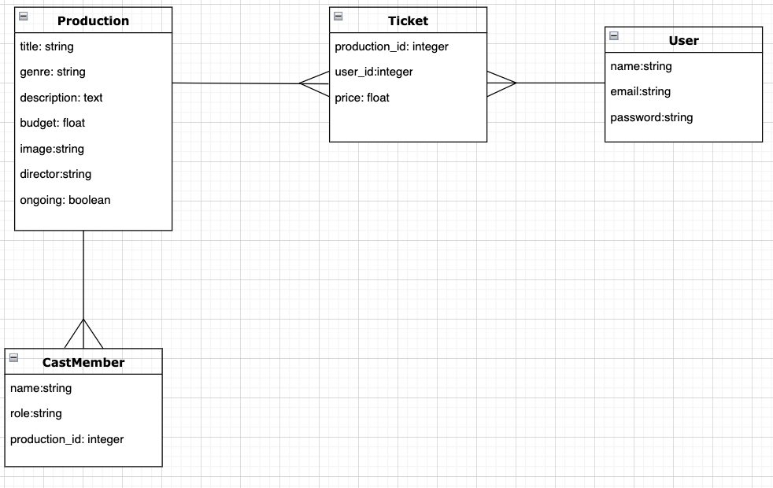

# Active Record Associations in Rails
## SWBATs:
- [ ] Observe how to use rails generators to create associations
- [ ] Observe how to create new migrations to alter existing model
- [ ] Observe how to create a new join instance from client
- [ ] Explain the purpose of serializers
- [ ] Observe how serializers are used to shape json data

Users -< Tickets > Producitons 

## Deliverables
- Demo migrations and foreign keys
    - Create some new resources based on the diagram above. 
        - rails g resource cast_member name role production:belongs_to   
        - rails g resource user name email password
        - rails g resource ticket production:belongs_to user:belongs_to
    - Seed and migrate
        - rails db:migrate
        - rails db:seed
    - Verify data in rails console with `CastMember.all`, `User.all` and `Ticket.all`
    - Restrict the routes for these models so they can be added back in as their relevant actions are built. 

- Demo one-to-many
    - Add a one-to-many relationship between Production and CastMembers in production model add `has_many :cast_members`
    - Test the relationship in rails console
    - Add `include: :cast_memberso` the show route (we will be refactoring this later)
    - Verify the route is working and send the correct data via the browser or postman
    -  Configure the client to render the CastMembers name and roles within the ProductionDetail component. 

- Demo many-to-many
    - Add a many-to-many relationship between Production and Users with Tickets as the join table
    ```
        has_many :tickets
        has_many :users, through: :tickets


        has_many :tickets
        has_many :productions, through: :tickets
    ```
    - Test the association in the rails console with `User.first.productions` and `Production.first.users`

    - In the User controller, ​​add a show action that will include the related tickets and production for the user. 
    ```
        def show 
            user = User.find(params[:id])
            ender json: user, include:[:tickets => {:include => :production}], status: :ok
        end
    ```
    - Add the show route for User in the routes.rb 
    - In the Client the UserPage component isfetching the User data. 
    - Finish the component by adding JSX that will render the ticket data. 
       - Note: This is a good opportunity to use debugging tools to verify the data sent by the api. 


- Demo Serializers 
    - gem 'active_model_serializers'
    - Rails g shows a new generator: serializer
    - Create a serializer for production with `rails g serializer production`
    - View production in the browser/postman to verify the response is now only sending over the id (note the client will error because of this)
    - Add the remaining attributes and view production in the browser again 
    `attributes :id, :title, :genre, :description, :budget, :image, :director, :ongoing`

- Demo Serializer relationships
    - Create serializers for the other models.
        - Rails g serializer user
        - Rails g serializer ticket
        - Rails g serializer cast_members

    - Add ` has_many :cast_members` to the production serializer to send the cast_members data with the production. 
    - Verify the ProductionDetail component is now loaded the data correctly
    
    - Add `has_many :tickets` to User 
    - Show the data in the browser/postman; you’ll notice that the production title isn’t being sent over with the ticket. (note the client will error because of this)
    - Adding   `has_one :production` to the ticket serializer will send the production along. 
    - However we can customize the attribute to be more specific. 
    ```    
        def production
            {title:object.production.title}
        end
    ```
    - Verify the tickets render correctly in the UserPage component. 

- Bonus:
- Demo Buy Ticket
    - Add a create route for tickets in routes.rb
    - In the Ticket controller add a create action

    - In the client in the ProductionDetail component, add an onClick to the ‘Buy Ticket’ button that calls a handler that makes a post to tickets. 
    - The Post should send the production_id, a price, and a user_id of 1 (Note: the user id will become dynamic in a later lecture, it’s hard coded for now.) 
    - Use history.push to render the UsersPage component if the post is sucessful.  

### Active Model Serializer
[Docs](https://learn.co/lessons/using-active-model-serializer)


Images:
landingPageImage
https://unsplash.com/photos/POd35V_uE4k
Published on February 16, 2018
Free to use under the Unsplash License
Dancer: Olivia Tarchick